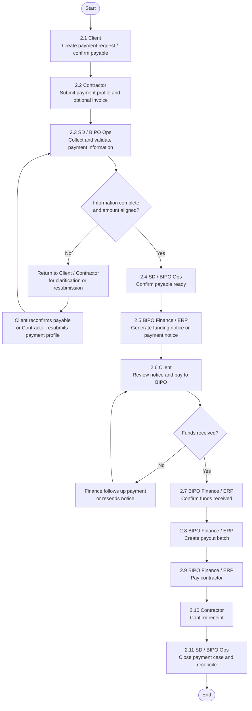

# COR Payment Mode 2 Flow

> 最后更新：2026-04-13

## 文档目的

本文档用于描述 COR 业务模式二的付款流程：

- 客户直接与 contractor 签约
- BIPO 不承担 `new contractor onboarding`
- BIPO 仅负责 `payment` 相关的资料校验、收款和代付执行

## 流程定义

模式二的核心原则是：

1. 客户确认本期 `payable`
2. contractor 提交付款所需资料
3. BIPO 校验付款资料并向客户发起 `funding notice`
4. 客户付款给 BIPO
5. BIPO 向 contractor 打款并完成对账

## 流程图

## 与模式一的关键差异

- 模式一中，BIPO 与 contractor 直接签约，因此通常需要先完成 `new contractor onboarding`
- 模式二中，客户与 contractor 直接签约，因此不应强制走 `onboarding`
- 模式一里，BIPO 往往同时承担 `contractor payable confirmation` 和 `client billing`
- 模式二里，客户才是 `payable owner`，BIPO 更偏向 `payment executor`
- 模式二下，contractor 提交的资料重点是 `payment readiness`，而不是完整入职资料

## 建模建议

- 将该流程建模为独立的 `PaymentCase`
- 在 `Engagement` 或 `Assignment` 上明确标记 `engagementMode = CLIENT_DIRECT`
- 对 `OnboardingCase` 支持 `NOT_APPLICABLE`
- 将 `payable confirmation`、`client funding`、`contractor payout` 视为三个独立阶段，而不是一个大一统状态流
