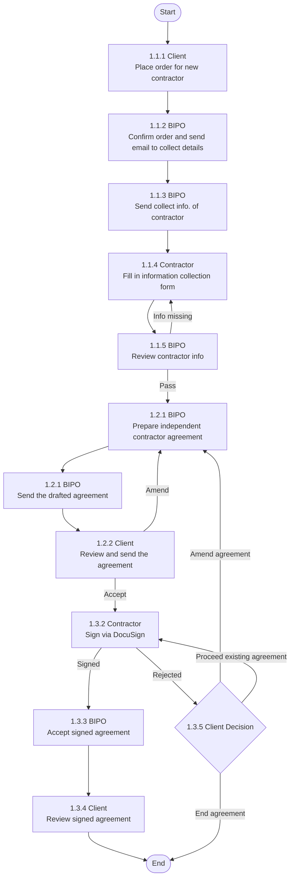

# COR Task Workspace 重构方案

> 最后更新：2026-04-10

## 文档目的

本文档用于定义 Butter 中 COR 业务的重构方向，重点解决以下问题：

- COR 流程相对固定，不需要继续依赖 flow 配置做动态流程编排
- 现有 Task Detail 页面主要由 `flow` 中配置的 system component 和 form template 直接渲染，页面表现更像“模板回显”，不适合任务执行
- 需要在任务执行过程中引入 AI 辅助能力，提供智能建议、缺失项提醒和风险提示，帮助不同角色更高效地完成任务

本文档聚焦 `COR fixed workflow + task workspace + AI copilot` 的目标态方案。

## 设计结论

本次 COR 重构不再以“流程配置”作为核心能力，而改为：

1. 后台按业务类型内置固定流程
2. 前端按 `taskType` 渲染任务工作台
3. AI 在 Task 执行层提供辅助判断和风险提示

对于 `New Contractor` 这类流程稳定的 COR 业务，建议直接在后台 hardcode 固定 workflow，不再要求 PM 或运营提前配置 flow。

## 适用范围

当前优先覆盖 COR 固定流程业务，例如：

- `New Contractor`
- 后续可扩展的 `Amendment`
- 后续可扩展的 `Termination / Offboarding`

这些业务的共同特点是：

- 流程稳定
- 任务类型有限
- 主要差异体现在任务内容和角色分工，而不是流程结构本身

## 核心问题

### 现状问题

当前 COR Task Detail 主要由 flow 配置驱动，典型问题包括：

- 页面结构取决于 form template，而不是取决于任务目标
- 同类任务页面缺乏统一的执行心智
- 信息展示以平铺表单、表格回显为主，缺乏工作台感
- 右侧信息栏偏静态信息堆叠，对当前任务决策帮助有限
- AI 难以围绕任务场景精确介入，只能做泛化提示

### 本次重构要解决的问题

1. 去掉 COR 对 flow 配置的依赖
2. 用固定流程和固定任务类型替代动态流程拼装
3. 把 Task Detail 从“模板渲染页”升级成“任务工作台”
4. 在任务执行中引入 AI 辅助，而不是让 AI 生成流程

## 设计原则

1. 保留 Butter 当前整体框架和视觉语言，不做脱离现有系统的全新产品形态。
2. COR 流程固定，优先减少系统复杂度，不为少量变体保留重型配置系统。
3. 页面应围绕“完成任务”设计，而不是围绕“渲染模板”设计。
4. 前端统一任务壳，内部主工作区按 `taskType` 切换模块。
5. AI 是任务辅助能力，不是流程控制能力。
6. 不同角色可进入同一任务，但应按角色显示不同的交互强度和信息密度。
7. 所有 AI 输出都应明确区分建议、系统状态和人工确认结果，避免黑盒化。

## 目标态产品定位

COR 在 Butter 中的目标态应定义为：

- `Workflow Engine` 负责创建固定流程任务
- `Task Workspace` 负责承载具体执行过程
- `AI Copilot` 负责在任务层做建议、校验、风险提示和下一步动作建议

从用户视角看，系统从：

- “通过 flow 配置决定 Task 页面长什么样”

升级为：

- “系统知道当前是什么任务，因此直接提供合适的工作界面和 AI 辅助”

## 总体架构

建议拆成 4 层。

### 1. Workflow Definition

后台维护固定流程定义，而不是动态 flow 配置。

每个固定 workflow 至少定义：

- `workflowCode`
- `workflowVersion`
- `requestType`
- `task sequence`
- `default assignee role`
- `dependencies`
- `completion rules`
- `skip rules`

示例：

`New Contractor`

当前流程的关键分支规则（as-is）：

- `1.1.5` 审核不通过（信息缺失）时，回退到 `1.1.4` 让 contractor 继续补录
- `1.2.2` Client 在该节点只允许做 `Amend` 或 `Accept`
- `1.3.2` 若 contractor 拒签，进入 `1.3.5`（Client 决策）
- `1.3.5` 可选 `Amend agreement`（回到 `1.2.2`，必要时先回 `1.2.1` 重新准备并发送）
- `1.3.5` 可选 `Proceed existing agreement`（返回签署路径）
- `1.3.5` 可选 `End agreement`（直接结束流程）

当前流程的关键业务校验点（来自流程图注释）：

- `1.1.1` 下单时增加受限规则校验：blocked country / nationality / bank account
- `1.1.4` 信息采集表单应收敛选项，降低证件和地址填报错误
- `1.1.4` 若 residence country 与 bank country 不一致，需要备注说明
- `1.2.1` 合同由系统自动生成，并补充采集阶段未覆盖但合同生成所需字段

### 2. Task Type Registry

系统维护固定的 `taskType -> 页面模块 -> AI profile` 映射。

示例：

| taskType | 页面模块 | AI profile |
|---|---|---|
| `collect_contractor_info` | `ContractorPersonalInfoFillModule` | fill guidance + completeness + consistency |
| `review_contractor_info` | `ContractorInfoReviewModule` | completeness gate + document match |
| `prepare_ic_agreement` | `AgreementDraftPrepModule` | clause readiness + data gap |
| `client_review_send_agreement` | `ClientAgreementReviewModule` | amend impact + signer + version |
| `contractor_sign_docusign` | `ContractorSigningModule` | signer progress + rejection signal |
| `client_decision_after_reject` | `ClientRejectDecisionModule` | amend vs proceed vs end |
| `review_signed_contract` | `ReviewSignedContractModule` | signature + document + readiness |

这层是替代原来 `flow component / form template` 配置的关键。

### 3. Task View Model

后端返回给前端的应是任务视图模型，而不是模板配置本身。

建议统一结构：

- `taskMeta`
- `taskType`
- `actorContext`
- `workspaceData`
- `contextSummary`
- `attachments`
- `integrationState`
- `aiSignals`
- `availableActions`

前端不再理解“当前 flow 配了哪些组件”，而是理解“当前任务需要什么工作界面”。

### 4. AI Copilot Layer

AI 不生成流程，也不自动完成关键任务，只在任务层做辅助：

- 分析当前任务数据
- 输出缺失项和风险
- 给出下一步建议动作
- 在必要时生成摘要或说明文案

## 页面框架

所有 COR 任务详情页统一采用 `Task Workspace` 框架。

### 1. Task Header

顶部统一展示：

- 任务标题
- 状态
- Assignee
- Due Date
- Remind Date
- 主操作按钮
- 次操作按钮，例如 `Refresh`、`Resend`、`Upload Manually`、`Mark Complete`

这部分建立统一的任务心智，不因 task type 改变。

### 2. Task Workspace

中间主区域按 `taskType` 渲染不同模块。

这是任务真正完成工作的区域，应围绕“如何完成这项任务”设计，不再直接平铺 form template。

### 3. Context Rail

右侧保留信息侧栏，但从“信息回显”改为“决策摘要”。

建议包含：

- `Task Information`
- `Request Summary`
- `Contractor / Client Snapshot`
- `Previous Task Outcome`
- `Related Attachments`
- `Integration Status`

右栏信息应短、可扫描、可支持当前决策，避免与主工作区重复。

### 4. AI Panel

AI 不建议做成独立聊天框，而建议作为固定辅助区。

统一输出 4 类信息：

- `Suggestions`
- `Risk Alerts`
- `Missing / Inconsistent Info`
- `Recommended Next Action`

在角色较轻的页面中，AI 可弱化为顶部提示卡；在 SD / 内部操作页中，AI 可作为右侧重要模块展示。

## 关键任务类型设计

考虑到 COR 任务类型预计在十几个以内，建议按任务类型构建专门模块，而不是继续维持强配置方案。

### 任务一：Contractor Fill in Personal Info.

#### 页面目标

由 SD 发起信息收集后，contractor 在该界面完成个人信息填写与附件上传；系统在填写过程中提供引导和校验，确保提交结果可直接进入 `1.1.5 Review contractor info`。

#### 页面结构

- `Overview`
- `Identity`
- `Contact`
- `Residential Address`
- `Bank Details`
- `Attachments`

#### 交互优化方向

- 用分组卡片替代整页大表格，并固定显示“当前填写进度”
- 每个分组展示完成度、异常标记和最后保存时间
- 附件与字段关联展示，减少 contractor 来回比对
- contractor 视角仅突出“待填写 / 待修正”项，弱化非必要上下文
- SD 视角展示发起状态、催办状态和 contractor 最近提交记录

#### AI 能力

- 字段级填写引导：根据国家和证件类型提示需要填写的必填项
- 实时完整性检查：在分组层提示缺失字段并给出可执行补齐建议
- 一致性校验：识别 nationality / residence country / bank country 的冲突
- 附件匹配校验：识别“已填但缺证明”或“上传附件与字段不匹配”
- 提交前预检：给出“可提交给 SD 审核 / 仍需补充”的结论和原因
- 沟通文案生成：一键生成给 SD 的备注说明（例如跨国银行信息解释）

### 任务二：Client Review and Send Agreement（1.2.2）

#### 页面目标

让 client 在统一界面完成“审阅合同、必要修订、确认发送”，并显式约束到 `Amend / Accept` 两类动作。

#### 页面结构

- `Contract Version`
- `Clause Change Summary`
- `Signing Order`
- `Signer Details`
- `Diff Against Previous Draft`
- `Action Area`

#### 交互优化方向

- 把长文本说明改为状态卡和明确动作区
- 把 signer 信息改造成顺序卡片或 stepper，而不是灰色输入框回显
- 把 `Amend`、`Accept and Send`、`Download Draft` 等动作集中展示
- 如果存在前置条件未满足，应在主区明显阻断

#### AI 能力

- 检查 amendment 是否影响核心条款
- 检查 signer email 是否异常或可疑
- 检查合同版本是否为最新
- 检查是否缺少 prerequisite
- 给出“建议 amend / 直接 accept”的理由摘要

### 任务三：Client Decision After Reject（1.3.5）

#### 页面目标

当 contractor 拒签后，要求 client 明确选择后续路径：`Amend agreement`、`Proceed existing agreement` 或 `End agreement`。

#### 页面结构

- `Rejection Summary`
- `Reason & Evidence`
- `Option Comparison`
- `Impact Preview`
- `Decision Action Area`

#### 交互优化方向

- 把三个可选分支做成互斥决策卡，避免误触发
- 选择分支后展示下一步影响（会回到哪个节点、是否重发、是否结束）
- 结束协议动作需要二次确认，且要求填写备注
- 允许查看上一版合同与拒签反馈，减少来回跳转

#### AI 能力

- 总结拒签原因并归类（条款、金额、签署人、时效等）
- 对比 `Amend / Proceed / End` 的风险与处理成本
- 提示当前选择对 SLA 和后续任务的影响
- 给出推荐选项及可解释依据

### 任务四：Review Signed Contract（1.3.3 / 1.3.4）

#### 页面目标

同步签署状态、接收已签合同、审查签署完整性，并判断是否可流转到下一任务。

#### 页面结构

- `Signature Timeline`
- `Signer Status Table`
- `Contract Preview`
- `Sync Status`
- `Review Decision Area`

#### 交互优化方向

- 签署状态和合同预览形成联动，而不是简单上下堆叠
- `Refresh from DocuSign` 和 `Upload Manually` 作为主要动作突出展示
- 在完成任务前展示 review summary，帮助 SD 快速判断
- 对于异常状态，提供明确处理路径而不是仅显示失败信息

#### AI 能力

- 判断是否所有必要签署方均已完成
- 判断是否存在签署顺序异常
- 判断当前合同文件是否与发送版本一致
- 检查是否缺页、异常页或签署缺失
- 生成“可进入下一任务 / 不可进入下一任务”的建议结论

## 角色模式

Task 使用者可能是 `SD`、`Client` 或 `Contractor`。建议采用“同一任务壳、不同角色模式”的设计。

### Contractor / Client 模式

- 页面更轻
- 信息密度更低
- 以填写、确认、上传为主
- AI 以提醒和解释为主

### SD / Internal Ops 模式

- 页面更重
- 展示上下文、前序结果和附件摘要
- 展示 AI 风险和缺失项
- 支持审核、催办、升级和例外处理

同一个 `taskType` 模块可基于 `actorRole` 进行模式切换，而不是拆成完全不同页面。

## AI 能力边界

AI 的定位必须清晰，避免重新走向黑盒。

### AI 应该做的

- 识别缺失信息
- 识别字段冲突
- 输出风险提示
- 总结外部集成状态
- 推荐下一步动作
- 生成说明文案草稿
- 对合同或附件做轻量审查摘要

### AI 不应该做的

- 自动修改流程
- 自动跳过关键审核
- 自动修改关键业务字段
- 自动完成任务
- 替代法务或交付的最终判断

### 产品展示要求

建议在页面中明确区分：

- `AI Suggested`
- `System Verified`
- `Manual Confirmed`

这样用户能清楚理解哪些是系统硬状态，哪些只是建议。

## 后台治理方式

取消 flow 配置后，后台治理应简化为 3 类能力。

### 1. Workflow Version

决定某类 COR request 使用哪套固定流程。

### 2. Task Type Definition

定义每个任务的元数据：

- `taskType`
- `displayName`
- `actorRole`
- `moduleKey`
- `completionRule`
- `actionSet`
- `aiProfile`

### 3. AI Rule Pack

按任务类型维护 AI 分析维度。

示例：

- `collect_contractor_info` 重点看 fill guidance / completeness / consistency
- `client_review_send_agreement` 重点看 amendment / signer / version
- `client_decision_after_reject` 重点看 rejection reason / branch impact
- `review_signed_contract` 重点看 signature / document / readiness

后台不再“配页面”，而是“配固定任务定义和 AI 分析边界”。

## 数据模型建议

建议以任务视图模型替代 form template 直接渲染模型。

### 推荐字段结构

#### taskMeta

- `taskId`
- `taskType`
- `stepCode`
- `title`
- `status`
- `assignee`
- `dueDate`
- `remindDate`

#### actorContext

- `actorRole`
- `permissions`
- `mode`

#### workspaceData

- 当前任务模块所需主数据
- 字段分组和状态
- 表单值、附件、文档或集成结果
- 当前分支状态（是否由拒签触发、当前决策选项）

#### contextSummary

- `requestInfo`
- `contractorInfo`
- `clientInfo`
- `previousTaskResult`

#### integrationState

- `docusignStatus`
- `syncTime`
- `lastError`

#### aiSignals

- `suggestions`
- `risks`
- `missingItems`
- `recommendedActions`

#### availableActions

- 可点击的动作清单
- 每个动作的启用条件和文案
- 分支类动作的二次确认与必填项约束（例如 `End agreement`）

## 上线策略

建议按两期推进。

### Phase 1

优先完成：

- COR 固定流程 hardcode
- 统一 `Task Shell`
- 3 至 5 个核心 `taskType` 模块
- 基础 `AI Panel`
- 去除对 flow form template 的直接依赖

### Phase 2

逐步补充：

- 更细的角色模式切换
- AI 风险分级
- 合同审查摘要增强
- 完成任务前的 pre-check
- AI explanation 和历史复盘能力

## 预期收益

完成重构后，预期收益包括：

1. 大幅降低 COR 对 flow 配置的依赖，减少后台维护复杂度
2. Task 页面更贴近真实业务动作，提升执行效率
3. AI 能围绕任务场景提供更精准、更可解释的辅助
4. 不同角色进入任务时可获得更合适的信息密度和动作入口
5. 为后续新增少量 COR 任务类型提供清晰扩展路径

## 最终结论

本次 COR 重构的关键，不是寻找一种更轻量的 flow 配置方式，而是直接将 COR 定义为固定流程业务。

真正需要替换的是：

- `flow-configured task rendering`

真正需要建立的是：

- `taskType-driven task workspace`

在这个基础上，AI 的最佳位置不是流程生成层，而是任务执行层。只有这样，Butter 才能在保留现有框架的前提下，把 COR 从“模板驱动页面”升级为“任务驱动工作台”。
