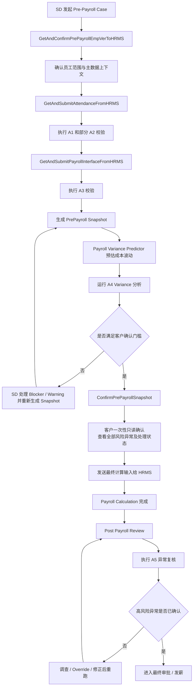
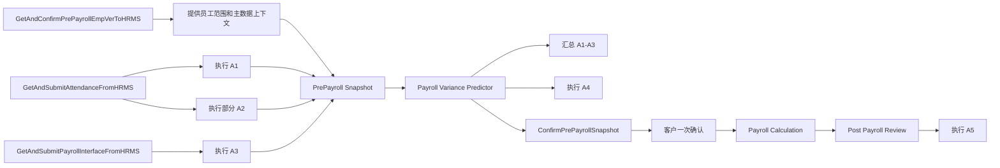
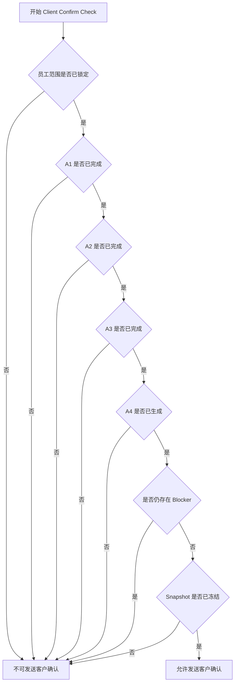

# Pre-Payroll 流程图文档

> 最后更新：2026-04-03

## 文档目的

本文档用于描述当前建议的 Pre-Payroll 端到端流程，明确：

- SD 在 Butter 中如何按组件分步获取数据
- `A1-A4` 如何在不同阶段执行
- 客户如何只进行一次确认
- `A5` 如何作为 payroll calculation 后的独立复核阶段存在

## 流程总原则

1. 数据来源于 HRMS，流程执行于 Butter。
2. SD 可以按组件分步取数和准备数据。
3. 客户不能被要求按模块多次确认。
4. 客户只对统一的 `PrePayroll Snapshot` 完成一次确认。
5. `A1-A4` 属于 pre-payroll 阶段，`A5` 属于 payroll calculation 后阶段。

## 总体流程图

## 分阶段流程说明

## 阶段一：发起与员工范围确认

对应组件：

- `GetAndConfirmPrePayrollEmpVerToHRMS`

目标：

- 确定本次 payroll period 的员工范围
- 确定 joiner、leaver、transfer、promotion 等异动人员
- 确定部门、成本中心、参与计算名单
- 识别会阻塞后续 `A1`、`A2`、`A4` 的主数据缺口

产出：

- 员工范围快照
- 主数据上下文
- 可进入后续取数阶段的基础范围

## 阶段二：Attendance / Leave 数据获取与校验

对应组件：

- `GetAndSubmitAttendanceFromHRMS`

目标：

- 获取 attendance、leave、OT 等数据
- 形成当前 payroll period 的 attendance 计算输入
- 运行 `A1` 和部分 `A2`

执行的业务规则：

- `A1` Attendance & OT Anomaly Detector
- `A2` Leave Balance & Payroll Impact Checker 中与 leave/pay period 直接相关的部分

主要产出：

- attendance exceptions
- leave impact exceptions
- 待其他数据补齐的规则状态

## 阶段三：Interface / Ad-Hoc 数据获取与校验

对应组件：

- `GetAndSubmitPayrollInterfaceFromHRMS`

目标：

- 获取 interface、ad-hoc pay、deduction 数据
- 形成 payroll 计算相关输入
- 运行 `A3`

执行的业务规则：

- `A3` Ad-Hoc Payment & Deduction Validator

主要产出：

- duplicate 风险
- 历史异常值
- policy 违规
- approval 风险

## 阶段四：Payroll Variance Predictor

对应模块：

- `Payroll Variance Predictor`

目标：

- 将员工范围、attendance、leave、interface、ad-hoc 等结果汇总成一个统一 snapshot
- 汇总 `A1-A3`
- 运行 `A4`
- 在正式 payroll 前完成成本估算、阈值预警与解释

执行的业务规则：

- `A1-A3` 汇总
- `A4` Payroll Variance Predictor

主要产出：

- blocker / warning / info 汇总
- 影响员工数
- variance dashboard
- threshold breach alert
- 可供 HR / SD / Manager 使用的 narrative explanation

## 阶段五：客户一次性确认

对应模块：

- `ConfirmPrePayrollSnapshot`

目标：

- 向客户展示一个完整、冻结版本的 pre-payroll package
- 客户只读查看，不编辑
- 客户只确认一次

客户看到的内容：

- 最终员工范围
- 最终 attendance / leave 数据
- 最终 interface / ad-hoc 数据
- 全部风险异常
- 每条异常的风险等级、原因、影响对象、建议动作
- 异常处理状态，包括已处理、已接受风险、未解决项
- 被排除项及原因
- 高风险提醒与业务影响说明

产出：

- 客户确认结果
- 可供 HRMS 进行 payroll calculation 的最终输入

边界说明：

- 客户可查看全部风险异常，但不能在确认页直接修改 HRMS 数据。
- 若客户基于异常要求调整，应由 SD 返回前置步骤处理并重新生成 snapshot。

## 阶段六：Payroll Calculation 后复核

对应模块：

- `Post Payroll Review`

目标：

- 在 payroll calculation 完成后执行 `A5`
- 在最终审批或发薪前识别高风险异常

执行的业务规则：

- `A5` Post-Payroll Calculation Anomaly Check

主要产出：

- 风险分级异常列表
- Accept / Investigate / Override 操作
- 审批门槛
- 审计日志

## 组件与校验分层流程图

## 客户确认发送判断流程图

## 推荐状态定义

组件级状态：

- `Pass`
- `Warning`
- `Blocker`
- `Pending Dependency`
- `Pending Baseline`
- `Not Applicable`

Snapshot / Client Confirm 状态：

- `Draft`
- `Under Review`
- `Ready for Client Confirm`

## 建议结论

推荐采用以下结构：

- 允许 SD 按组件分步获取和准备数据
- 允许各组件分别承接适合自己的 `A1-A3` 规则
- 用 Payroll Variance Predictor 做成本预估、阈值预警与下钻解释
- 客户始终只面对一个确认入口
- 将 `A5` 保持为 payroll calculation 之后的独立阶段

该结构既符合当前组件形态，也符合“不让客户反复确认”的核心原则。
